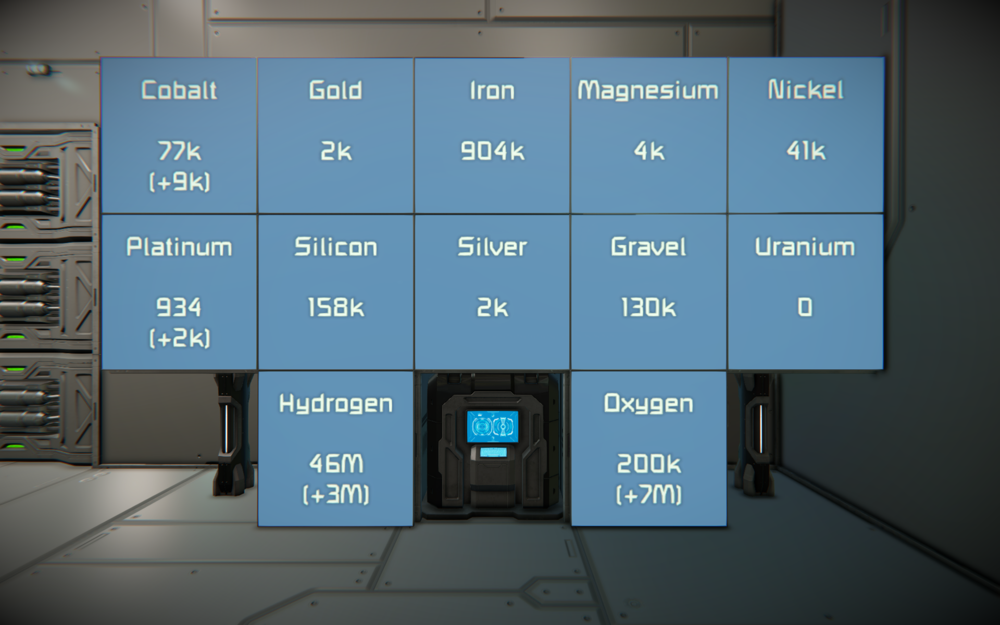

= Space Engineers Scripts
:toc:

== Scripts

=== Auto Crafter

This script automatically produces items if the amount in the network drops below a configurable threshold.

*Configuration*

[source,csharp]
----
string assembler = "Assembler (Cube MK-1)";
Group[] groups = {
    // g("item name", "bp name", minimum, maximum)
    g("MyObjectBuilder_Component/SteelPlate", "MyObjectBuilder_BlueprintDefinition/SteelPlate", 20000, 30000),
    g("MyObjectBuilder_Component/Medical", "MyObjectBuilder_BlueprintDefinition/MedicalComponent", 10, 20),
};
----

You can configure as many groups as you want.

The item name is the internal name of the item which you can take in your inventory or put into cargo containers.

The blueprint (bp) name is the internal name of the recipe in the assembling machine which is put into the queue to craft the item.

If the amount of an item in the network (across all inventories connected with conveyor tubes) drops below the `minimum` it will craft this item to reach the maximum.

For a list with item and blueprint names, see this comment on reddit:
https://www.reddit.com/r/spaceengineers/comments/adbzhf/comment/edgjo48

=== Inventory Status Display

This script will print the status of various items (primarily ingots) on LCD panels, one panel per item.

Besides the current amount of e.g. iron ingots, the script can look for iron ore and calculate what theoretically can be refined.

*Configuration*

[source,csharp]
----
Group[] groups = {
    // g("label", "display block name", display number, "item name", "source item name", conversion rate),
    g("Cobalt", "LCD Panel Status Cobalt (SB)", 0, "MyObjectBuilder_Ingot/Cobalt", "MyObjectBuilder_Ore/Cobalt", 0.3f),
    g("Gold", "LCD Panel Status Gold (SB)", 0, "MyObjectBuilder_Ingot/Gold", "MyObjectBuilder_Ore/Gold", 0.01f),
    g("Iron", "LCD Panel Status Iron (SB)", 0, "MyObjectBuilder_Ingot/Iron", "MyObjectBuilder_Ore/Iron", 0.7f),
};
----

To not consider ore (source item name and conversion rate) just put in an empty string and a zero:

[source,csharp]
----
    g("Uranium", "LCD Panel Status Uranium (SB)", 0, "MyObjectBuilder_Ingot/Uranium", "", 0f),
----

== How this repository works

1. `src/template.cs` can be copied for a new script, be sure to change the namespace from `Template` to something unique (for this project)
2. Do not remove the `// start` and `// end` comments and put the script code in between those.
3. Code
4. Press CTRL + F5 (default shortcut for "Run Without Debugging"), this will run an export script (see below for details).

=== Export Script

The file `export.ps1` is used to export the currently opened file.
If executed via VS Code (see `.vscode/launch.json`) it will be called with parameters about the currently opened file.

The script does the following two things:

1. It creates/updates a `script.*.txt` file in the top level of this workspace.
2. It copies the content of the script into the clipboard.

Both are ready for use to paste into the ingame editor of a Programmable Block.

Internally it reads the content of the currently opened file, extracts everything between `// start` and `// end` and strips the leading spaces.

=== csproj

The file `space-engineers-scripts.csproj` works with the default Steam installation folder.

If the game is installed somewhere else the paths in this file have to be changed.

Installed software:

- VS Code
- VS Code Extension C# (ms-dotnettools.csharp): https://marketplace.visualstudio.com/items?itemName=ms-dotnettools.csharp
- .NET 6
